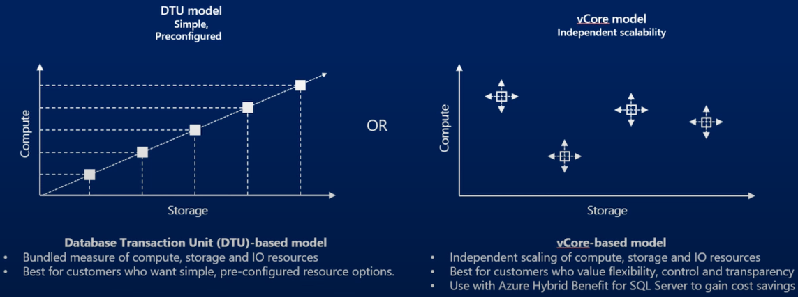

# Azure Database

Azure DB is a general-purpose **relational database-as-a-service** (DBaaS) based on the latest stable version of Microsoft SQL Server Database Engine. 

## Why relational databases?
Relational databases are:

1. Perfect for managing **structured data** via 

    1. Schema
    2. Constraints
    3. Relationships

2. Include **rich query** capabilities

## Deployment models

Azure SQL Database provides the three deployment options:

* **Single** is fully managed, isolated database
* **Elastic Poll** is a collation of single databases with a shared set of resources
* **Managed Instance** is a fully managed instance of the SQL Server

## SQL Database Server vc SQL Database

Database **Server** act as a central administrative point for **multiple single** or **pooled databases**, logins, firewall rules, auditing rules, threat detection policies, and failover groups.

## Purchasing models
Azure SQL DB offers two purchasing models
* Database transaction unit (**DTU**)-based purchasing model
* Virtual core (**vCore**)-based purchasing model (recommended)
* **Serverless** model (vCore)-based

## Why Elastic  Pool?
1. **Cost-Effective**: Elastic pools are a cost-effective solution for managing multiple databases. They allow you to purchase resources for a pool shared by multiple databases, accommodating unpredictable usage periods by individual databases.

2. **Resource Optimization**: Elastic pools ensure that databases get the performance resources they need when they need them. This eliminates the need to overprovision resources based on peak usage, which can lead to overpayment, or underprovision to save cost at the expense of performance and customer satisfaction during peaks.

3. **Scalability**: Elastic pools provide a simple resource allocation mechanism within a predictable budget. They allow you to manage compute resources at scale and require less overprovisioning per database to accommodate for compute-intensive periods.

4. **Flexibility**: With elastic pools, you can set minimum and maximum resource limits for the databases within the pool3. Each database can use the needed resources within the limits set, depending on the current load.

5. **Simplicity**: Elastic pools simplify the complexity of managing the performance of individual databases. They are ideally suited for SaaS and line-of-business applications that need the performance, availability, and security isolation benefits of provisioning one database for each tenant or application.

### What about serverless 
